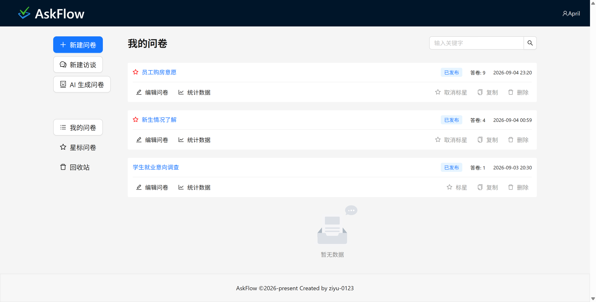
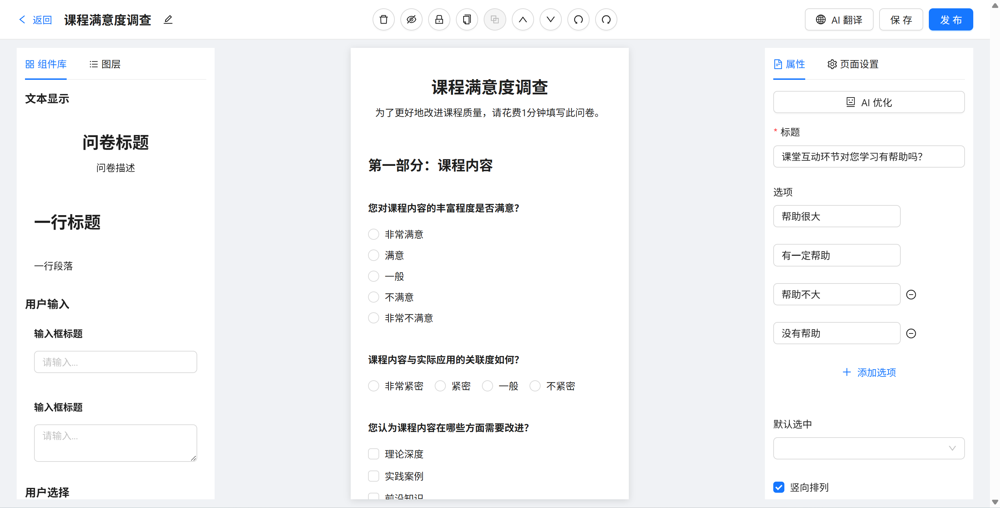
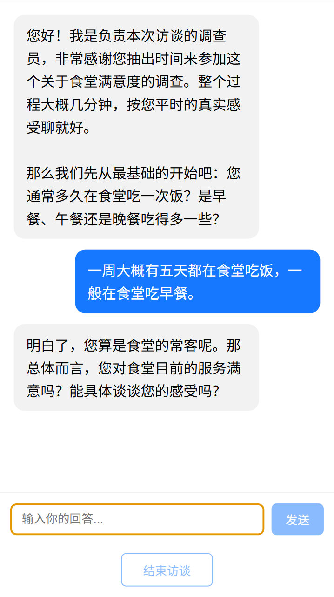
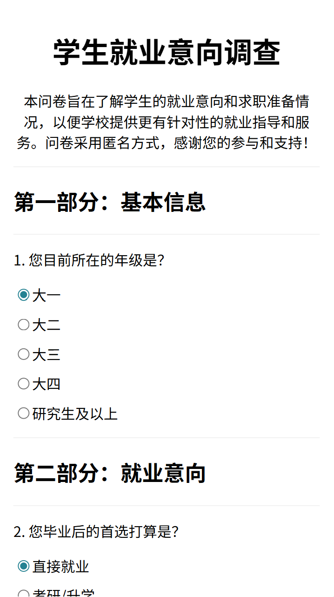

# AskFlow — AI 驱动的问卷与访谈平台

AskFlow 是一个全栈的问卷 / 访谈平台，覆盖问卷的**创建、发布、填写、统计**全流程，并深度集成 LLM，提供问卷生成、题目润色、多语言翻译、开放题总结、分析报告、AI 对话式访谈等能力。问卷分为两种类型：**普通问卷（survey）**与 **AI 访谈（interview）**，后者以聊天对话的形式逐题收集信息。

## 📸 部分界面预览

1. **问卷列表页（B 端）** —— 搜索、星标、回收站、分页
   

2. **编辑页（B 端）** —— 拖拽问卷编辑器（组件库 + 画布 + 属性面板）
   

3. **流式访谈页（C 端）** —— AI 聊天式访谈，SSE 流式输出
   

4. **常规问卷答卷页（C 端）** —— 表单填写并提交
   

## ✨ 功能特性

### 账号与配置

- 用户注册 / 登录（JWT 鉴权，全局守卫 + 公开接口白名单）
- AI 设置（BYOK）：用户自带 API Key / Base URL / 模型，服务端只回显打码后的 Key

### 问卷管理端（AskFlow）

- 问卷列表：关键词搜索、分页、标星、回收站、复制、批量删除
- 拖拽式问卷编辑器：7 种组件（问卷信息 / 标题 / 段落 / 单行输入 / 多行输入 / 单选 / 多选），支持图层管理、隐藏 / 锁定、撤销重做
- 问卷发布与分享（链接 + 二维码）
- 两种问卷类型并存：普通问卷走拖拽编辑器，访谈问卷走独立配置页

### 创建端 AI

- **自然语言生成问卷**：输入一句需求，结构化输出直接进入编辑器
- **题目补全 / 润色**：单题智能续写与改写
- **整卷多语言翻译**：支持英 / 日 / 韩 / 法 / 西 / 俄 6 种语言，译文持久化保存
- **AI 生成访谈提纲**：根据访谈标题与描述生成引导问题清单，可继续手动增删

### 填写端（askflow-client）

- 普通问卷：表单填写并提交
- AI 访谈：SSE 流式对话、逐字打字机效果，AI 沿提纲逐题追问，收尾输出结束标记，轮次上限兜底

### 分析端（AskFlow 统计页）

- 单选 / 多选图表 + 答卷表格 + 分页
- **AI 总结开放题**：意见聚类 + 情感分析（正面 / 负面 / 中性）
- **AI 整卷分析报告**：总体结论 + 逐题洞察（含图表建议）+ 改进建议
- 访谈统计：逐份聊天记录 + AI 整卷总结

## 🛠 技术栈

| 模块 | 技术 |
| --- | --- |
| 管理端（AskFlow） | React 19 + TypeScript + Vite + Redux Toolkit + antd + dnd-kit + recharts + react-router-dom + redux-undo + qrcode.react |
| C 端（askflow-client） | Next.js 16（Pages Router）+ React 19，SSE 用 fetch `ReadableStream` 解析 |
| 后端（question-server-nestjs） | NestJS 12 + MongoDB + Mongoose + JWT + bcryptjs + zod + OpenAI SDK + Swagger |
| 工程化 | Docker / docker-compose、GitHub Actions CI、Vitest、ESLint / Oxlint、Prettier、Husky + commitlint |

## 🚀 快速启动

### 后端 + MongoDB

```bash
cd question-server-nestjs
npm install
cp .env.example .env   # 配置 MongoDB / JWT_SECRET / CORS_ORIGINS
npm run start:dev      # http://localhost:3005

# 或使用 Docker 一键启动后端 + MongoDB
docker compose up
```

### 管理端（本项目）

```bash
npm install
npm run dev   # http://localhost:5173
```

### C 端

```bash
cd askflow-client
npm install
npm run dev   # http://localhost:3000
```

## 🔧 环境变量

### 后端（question-server-nestjs）

| 变量 | 说明 |
| --- | --- |
| `MONGO_URI` | MongoDB 连接串（部署云库时用，优先于下面三个变量） |
| `MONGO_HOST` / `MONGO_PORT` / `MONGO_DATABASE` | 本地 MongoDB 连接 |
| `JWT_SECRET` | JWT 签名密钥（生产环境必填，缺失将启动报错） |
| `CORS_ORIGINS` | 允许的前端地址，逗号分隔 |
| `PORT` | 后端端口（默认 3005） |

### 管理端（AskFlow）

| 变量 | 说明 |
| --- | --- |
| `VITE_API_BASE` | 后端地址（默认 `http://localhost:3005/`） |
| `VITE_CLIENT_BASE` | C 端地址（用于分享链接 / 二维码，默认 `http://localhost:3000`） |

### C 端（askflow-client）

| 变量 | 说明 |
| --- | --- |
| `NEXT_PUBLIC_API_BASE` | 后端地址（默认 `http://localhost:3005`） |

## 🔗 在线 Demo

| 服务 | 地址 |
| --- | --- |
| 管理端 | https://preeminent-pavlova-283592.netlify.app |
| C 端填写端 | https://cheery-pixie-eed383.netlify.app |
| 后端接口文档（Swagger） | https://question-server-nestjs-production.up.railway.app/api/docs |

> 说明：AI 能力为 BYOK 模式，注册后在管理端「AI 设置」填入自己的 API Key 即可体验。